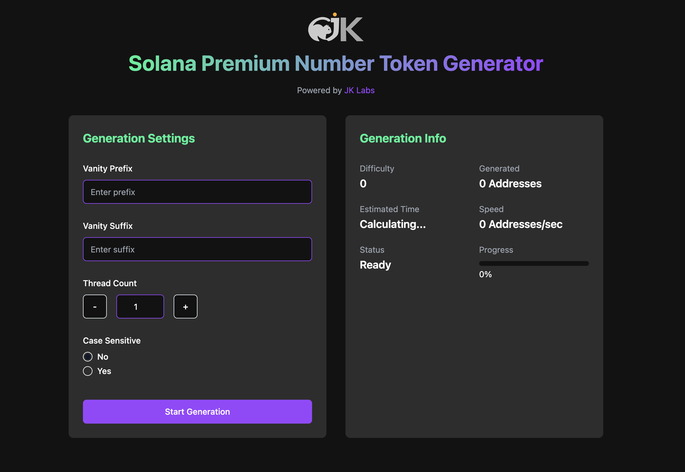

# Solana Premium Number Token Generator

Solana Premium Number Token Generator is a powerful tool designed for generating Solana token addresses with customizable prefixes and suffixes. This generator provides flexibility for creating vanity Solana addresses tailored to specific needs. The tool is efficient, user-friendly, and perfect for developers and enthusiasts looking to create unique token addresses.

Powered by [JK Labs](https://3jk.net)

Tools : https://sol-pre.3jk.net



---

## Features

- **Custom Vanity Prefix and Suffix**: Specify exact text for the beginning or end of the token address.
- **Thread Management**: Adjust the number of threads to optimize performance based on your system capabilities.
- **Case Sensitivity**: Choose whether the prefix/suffix search is case-sensitive or not.
- **Real-time Feedback**:
  - View the estimated generation time.
  - Monitor progress, difficulty, and generation speed.

---

## Usage Instructions

### Prerequisites

- Ensure you have **Node.js** (>= 16.x) and **npm** installed.
- Install dependencies by running:

  ```bash
  npm install
  ```

---

### Running the Generator

1. Clone the repository:

   ```bash
   git clone https://github.com/<your-repo-url>/solana-premium-number-token.git
   cd solana-premium-number-token
   ```

2. Start the tool:

   ```bash
   npm start
   ```

3. Open your browser and navigate to `http://localhost:3000`.

4. Configure your settings:
   - Enter a **Vanity Prefix** (e.g., "SOL") or **Vanity Suffix** (e.g., "2024").
   - Adjust the thread count as needed.
   - Enable/disable case sensitivity.
   - Click **Start Generation** to begin.

---

### Output

The generated addresses will appear in the **Generated Addresses** section once complete. Use these addresses in your Solana projects as needed.

---

## Development Details

### Architecture

The application is divided into two main parts:
1. **Frontend**:
   - Built with **React.js** for an intuitive user interface.
   - Designed for responsiveness and ease of use.

---

## Contributing

We welcome contributions! Follow these steps to get started:

1. Fork the repository.
2. Create a feature branch: `git checkout -b feature-name`.
3. Commit changes: `git commit -m "Add feature-name"`.
4. Push to your forked repository: `git push origin feature-name`.
5. Create a pull request.

---

## License

This project is licensed under the [MIT License](LICENSE).


---

## Support

If you encounter any issues or have suggestions, please open an issue on GitHub or contact us at [jackykit@gmail.com](mailto:jackykit@gmail.com).
